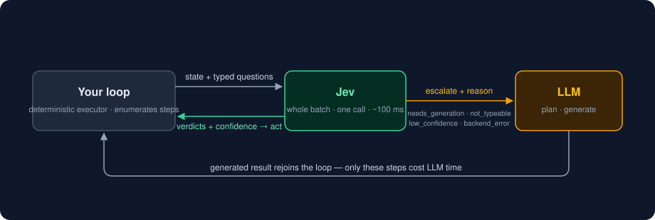

# Reference



## `jev_judge`

Batch every question about one state into one call — latency is flat in
question count ([measured](https://github.com/Nyarlathoteppppp/pi-heed/blob/main/EXPERIMENTS.md):
1/4/8 questions ≈ 274 ms median), and cost amortizes across the shared state.

| Param | Type | Notes |
| --- | --- | --- |
| `state` | string | everything Jev may consider — facts, tool output, file excerpts (≤ ~30k tokens) |
| `questions[]` | array | each: `{id?, type, question, options?, levels?, criteria?}` |
| `questions[].type` | `noul` \| `choice` \| `score` | noul = probability a statement is true; choice = pick one enumerated option; score = position on an ordered list of levels |
| `questions[].options` | choice only | ≥ 2 labels, or a `label → meaning` map |
| `questions[].levels` | score only | ≥ 2 ordered level descriptions |
| `questions[].criteria` | noul only, optional | `{true, false}` meanings, to sharpen calibration |
| `confidence_threshold` | number, default `0.75` (`0.4` via Vercel — margin semantics) | verdicts below it escalate |
| `model` | string, optional | backend model override |

```jsonc
// input
{
  "state": "CI run #142: build ok, 214 tests passed, 0 failed; 1 test quarantined as flaky last week",
  "questions": [
    { "id": "passed", "type": "noul",   "question": "Did the run fully succeed?" },
    { "id": "next",  "type": "choice", "question": "Next action?",
      "options": { "merge": "everything green", "rerun": "looks flaky", "hold": "needs attention" } },
    { "id": "risk",  "type": "score",  "question": "How risky is merging now?",
      "levels": ["routine", "worth a look", "incident"] }
  ]
}
```

```jsonc
// result (shape exact, values illustrative)
{
  "verdicts": [
    { "id": "passed", "type": "noul",   "answer": 0.97, "confidence": 0.94, "escalate": false },
    { "id": "next",  "type": "choice", "answer": "merge", "confidence": 0.34, "escalate": true,
      "reason": "unsure", "distribution": { "merge": 0.55, "rerun": 0.41, "hold": 0.04 },
      "hint": "Jev answered (merge) at confidence 0.34 < 0.75. Treat the answer as a prior, not a decision — reason it out yourself." },
    { "id": "risk",  "type": "score",  "answer": 0.8, "confidence": 0.81, "escalate": false,
      "distribution": { "0": 0.35, "1": 0.5, "2": 0.15 },
      "legend": { "0": "routine", "1": "worth a look", "2": "incident" } }
  ],
  "escalated": true,
  "backend": "typesafe",
  "latencyMs": 187
}
```

A score `answer` is the distribution's expected position on your levels —
`0.8` means "between *routine* and *worth a look*, closer to the latter";
`legend` maps indices back to your words.

## `jev_gate`

One proposed action, one risk check.

| Param | Type |
| --- | --- |
| `state` | string — current task context |
| `tool`, `input` | the action, verbatim |
| `description` | optional intent |
| `confidence_threshold` | default `0.75` (`0.4` via Vercel) |

Returns `{decision: allow | deny | escalate, confidence, hint}` — one
allow/deny `choice` under the hood, `escalate` when confidence falls below
the threshold. **`allow` stays silent and falls through to your normal
permission flow — the gate can never grant anything, only deny or ask — and
if Jev is down it fails open.** As a PreToolUse hook it spends zero LLM
tokens on the allow path (a deny/ask feeds its reason back to the model —
that is the point) and adds one ~100 ms round trip per gated call, so scope
the matcher to tools worth gating.

## The verdict contract

Every verdict:
`{id, type, answer, confidence, escalate, reason?, hint?, distribution?, legend?}`.
`reason`/`hint` appear exactly when `escalate` is true; `distribution`/`legend`
whenever the provider returns them.

| reason | when | meaning |
| --- | --- | --- |
| `writing` | pre-call | the step must produce new text/code — structurally the LLM's |
| `open_ended` | pre-call | not expressible as noul/choice/score (nothing to enumerate) |
| `oversized` | pre-call | the state exceeds ~30k tokens — shrink it or take the questions over |
| `unsure` | post-call | answer too flat to act on; it stays in `answer` as a prior |
| `unreachable` | on failure | Jev unreachable — proceed as if it didn't exist |

Pre-call reasons come from a deterministic router (no request spent); each
handback is a normal verdict with a hint, never an exception.

**What the `confidence` scalar is:** for `choice`/`score` it is the
provider's own confidence field (an opaque model head, not derivable from
the distribution) — except through the Vercel gateway, which returns none,
so jev-use falls back to top-minus-runner-up margin, a different and
uncalibrated quantity. For `noul` the API reports no confidence, so it is
computed as certainty, `2·|p − 0.5|`. Because margin runs systematically
lower than a vendor confidence head, the Vercel backend's default threshold
is `0.4` (others `0.75`); an explicit `confidence_threshold` always wins.

## Library

```js
import { Jev, check, pick, rate } from "jev-use";

const jev = new Jev();                 // backend resolved from the environment

const { answers, verdicts } = await jev.judge(state, {
  next: pick("Next action?", { merge: "all green", rerun: "looks flaky", hold: "needs attention" }),
  risk: rate("How risky?", ["routine", "worth a look", "incident"]),
  passed: check("Did the run fully succeed?"),
});
answers.next;   // { answer: "merge", confidence: 0.93, escalate: false }

const verdict = await jev.gate(state, { tool: "Bash", input: { command } });
verdict.decision;   // "allow" | "deny" | "escalate"
```

Both halves of the handoff are in the surface. Before writing a question,
`route` says whether the step is Jev-shaped at all — no client, no key, no
call:

```js
import { route } from "jev-use";

route({ producesContent: true, enumerable: true });    // { to: "llm", reason: "writing" }
route({ producesContent: false, enumerable: false });  // { to: "llm", reason: "open_ended" }
route({ producesContent: false, enumerable: true });   // { to: "jev" }
```

After the call, every answer carries the other half — `escalate`, `reason`,
`hint`, and Jev's answer kept as a prior ([the table above](#the-verdict-contract)).

The three builders write the three primitives — `check` → `noul`, `pick` →
`choice`, `rate` → `score` — and the wire vocabulary stays exactly that.
`answers` is keyed by the names you asked under; `verdicts` is the same
verdicts in the order you asked them, alongside `escalated`, `backend`,
`model`, `latencyMs` and `usage`.

`new Jev({ backend: "mock" })` judges with no key at all, and
`new Jev({ backend: myBackend })` takes any `JevBackend` (tests, custom
transports). Defaults set on the client — `confidenceThreshold`, `model` —
are overridable per call: `jev.judge(state, questions, { model })`.

## Configuration

| Setting | Default | Meaning |
| --- | --- | --- |
| `JEV_BACKEND` | auto-detect | `typesafe` \| `openrouter` \| `vercel` \| `mock` |
| `TYPESAFE_API_KEY` / `OPENROUTER_API_KEY` / `AI_GATEWAY_API_KEY` | — | provider credential; auto-detected in this order |
| `JEV_MODEL` | provider default (`jev-latest`) | model override |
| `JEV_GATE_THRESHOLD` | backend default (`0.75`; `0.4` via Vercel) | hook-gate escalation threshold |

Provider dialects: TypeSafe and OpenRouter share the native wire shape
(OpenRouter's `decisions` endpoint is alpha and may move); Vercel's gateway
renames `noul`→`boolean`, moves the model into a header, and drops
confidence/legend. All three are normalized by the adapters; wire shapes are
pinned by fixture tests against documented formats — `jev-use doctor` is the
live check.

## CLI

```
jev-use install [claude|codex|pi]   wire the server into your harness via its own CLI (all found, if no target)
jev-use serve                 stdio MCP server
jev-use hook gate             PreToolUse hook adapter (Claude Code / Codex)
jev-use judge ['{...}']       one-shot JudgeRequest from argv or stdin
jev-use doctor                backend resolution + one live round trip
```
